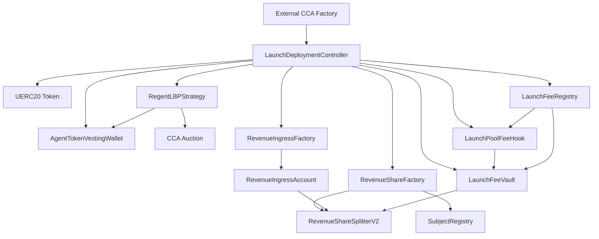

# Autolaunch Architecture Guide

This guide describes the full Autolaunch system that now lives in the local `contracts/` workspace.

The canonical product rules live in `/Users/sean/Documents/regent/autolaunch/docs/product_invariants.md`. If this guide drifts from that file, update this guide.

## Core idea

Autolaunch has one launch stack and one ongoing revenue stack.

- The launch stack creates the token, auction, pool fee plumbing, subject wiring, and the official v4 LP migration path.
- The revenue stack recognizes only Base USDC that reaches the subject revsplit.
- The Regent-side launch-pool fee lane is a plain treasury payout.
- Recognized subject USDC sends 1% into `RegentRevenueStaking`, uses 10% of the remaining 99% to buy `$REGENT` for the agent treasury, and leaves 89.1% in the subject revsplit lane.
- The staking revenue router must have a Regent buyback adapter set before recognized subject USDC can complete this route.

## Core contracts

- external CCA factory
- UERC20-compatible token factory
- `LaunchDeploymentController`
- `AgentTokenVestingWallet`
- `RegentLBPStrategy`
- `RegentLBPStrategyFactory`
- `LaunchFeeRegistry`
- `LaunchFeeVault`
- `LaunchPoolFeeHook`
- official Uniswap v4 pool manager and position manager
- `SubjectRegistry`
- `RevenueShareFactory`
- `RevenueIngressFactory`
- `RevenueIngressAccount`
- `RevenueShareSplitterV2`

## System diagram

## Launch flow

1. `LaunchDeploymentController` creates the launch token through a UERC20-compatible factory.
2. It creates the vesting wallet.
3. It creates the subject revsplit and the default ingress address.
4. It deploys the fee registry, fee vault, and fee hook.
5. It initializes the strategy, funds it, and the strategy creates the CCA auction.
6. On migration, the strategy initializes the official v4 pool if needed, mints a full-range position through the official position manager, and stores the minted pool and position ids onchain.
7. It returns the whole result set through `CCA_RESULT_JSON:`.

The subject revsplit and default ingress address are created before auction graduation. The detailed creation flow is described in `/Users/sean/Documents/regent/autolaunch/docs/stake-split-payment-receiver-flow.md`.

## Fee flow

The launch pool charges a 2% fee in the $REGENT-quoted pool:

- 1% goes to the agent treasury
- 1% goes to the Regent side

The launch controller threads the official pool fee and tick spacing into the migration path so the strategy and launch fee registry stay aligned.

The fee vault stores those balances until the configured recipients withdraw them.

## Revenue recognition rule

The active rule is simple:

- only Base USDC counts
- it counts only when it reaches the subject revsplit

That keeps one canonical accounting point and avoids cross-chain or offchain revenue bookkeeping inside the protocol core.

## What is not part of the active story anymore

- the old rights-hub plus vault split
- the old per-launch agent registry shape
- automatic `$REGENT` staker reward accounting inside the launch path
- building new Autolaunch work in `monorepo/contracts`
