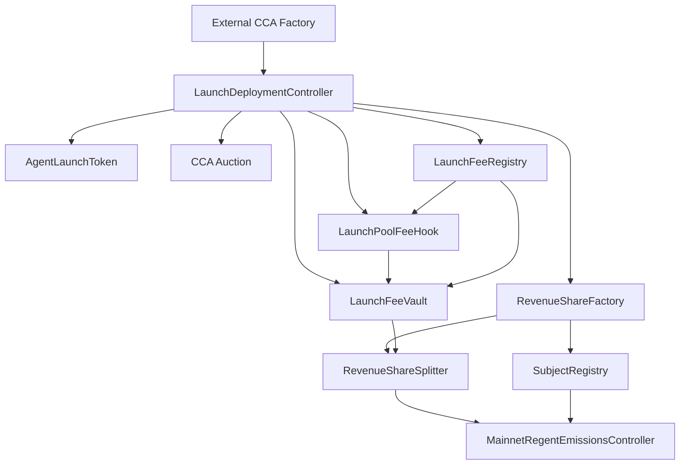

# Autolaunch Architecture Guide

This guide describes the full Autolaunch system that now lives in the local `contracts/` workspace.

## Core idea

Autolaunch has one launch stack and one ongoing revenue stack.

- The launch stack creates the token, auction, pool fee plumbing, and subject wiring.
- The revenue stack recognizes only mainnet USDC that reaches the subject revsplit.
- The mainnet emissions controller is the emissions rail tied to that recognized onchain state.

## Core contracts

- external CCA factory
- `AgentLaunchToken`
- `LaunchDeploymentController`
- `LaunchFeeRegistry`
- `LaunchFeeVault`
- `LaunchPoolFeeHook`
- `SubjectRegistry`
- `RevenueShareFactory`
- `RevenueShareSplitter`
- `MainnetRegentEmissionsController`

## System diagram

## Launch flow

1. `LaunchDeploymentController` creates the agent token.
2. It initializes the CCA auction through the external factory.
3. It deploys the launch fee registry, fee vault, and fee hook.
4. It creates the subject revsplit through `RevenueShareFactory`.
5. It registers the subject in `SubjectRegistry`.
6. It returns the whole result set through `CCA_RESULT_JSON:`.

## Fee flow

The launch pool charges a 2% fee in the USDC-quoted pool:

- 1% goes to the subject revenue lane
- 1% goes to the Regent side

The fee vault stores those balances until the configured recipients withdraw them.

## Revenue recognition rule

The active rule is simple:

- only mainnet USDC counts
- it counts only when it reaches the subject revsplit

That keeps one canonical accounting point and avoids cross-chain or offchain revenue bookkeeping inside the protocol core.

## Emissions role

`MainnetRegentEmissionsController` is the main emissions contract in the active architecture. It sits on top of the recognized onchain USDC path and is the intended mainnet emissions rail.

## What is not part of the active story anymore

- the old rights-hub plus vault split
- the old per-launch agent registry shape
- building new Autolaunch work in `monorepo/contracts`
