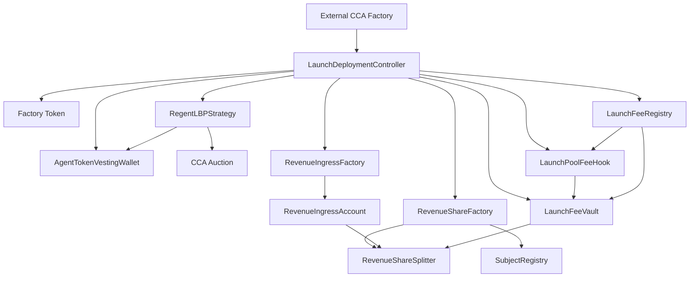

# Autolaunch Architecture Guide

This guide describes the full Autolaunch system that now lives in the local `contracts/` workspace.

## Core idea

Autolaunch has one launch stack and one ongoing revenue stack.

- The launch stack creates the token, auction, pool fee plumbing, subject wiring, and the official v4 LP migration path.
- The revenue stack recognizes only Sepolia USDC that reaches the subject revsplit.
- The Regent-side fee lane is a plain treasury payout, not a rewards rail.
- A separate Base-mainnet `RegentRevenueStaking` rail can accept manual Base USDC deposits for `$REGENT` stakers, but it is outside the active Sepolia launch path.

## Core contracts

- external CCA factory
- `LaunchDeploymentController`
- `AgentTokenVestingWallet`
- `RegentLBPStrategy`
- `RegentLBPStrategyFactory`
- `LaunchFeeRegistry`
- `LaunchFeeVault`
- `LaunchPoolFeeHook`
- official Uniswap v4 pool manager and position manager
- `SubjectRegistry`
- `RevenueShareFactory`
- `RevenueIngressFactory`
- `RevenueIngressAccount`
- `RevenueShareSplitter`

## System diagram

## Launch flow

1. `LaunchDeploymentController` creates the launch token through the configured token factory.
2. It splits supply into 10% auction, 5% LP reserve, and 85% vesting.
3. It deploys the vesting wallet, strategy, fee registry, fee vault, and fee hook.
4. The strategy creates the CCA auction and keeps the reserve allocation.
5. On migration, the strategy initializes the official v4 pool if needed, mints a full-range position through the official position manager, and stores the minted pool and position ids onchain.
6. The controller creates the subject revsplit and the default ingress address.
7. It returns the whole result set through `CCA_RESULT_JSON:`.

## Fee flow

The launch pool charges a 2% fee in the USDC-quoted pool:

- 1% goes to the subject revenue lane
- 1% goes to the Regent side

The launch controller threads the official pool fee and tick spacing into the migration path so the strategy and launch fee registry stay aligned.

The fee vault stores those balances until the configured recipients withdraw them.

## Revenue recognition rule

The active rule is simple:

- only Sepolia USDC counts
- it counts only when it reaches the subject revsplit

That keeps one canonical accounting point and avoids cross-chain or offchain revenue bookkeeping inside the protocol core.

## What is not part of the active story anymore

- the old rights-hub plus vault split
- the old per-launch agent registry shape
- automatic REGENT reward accounting inside the Sepolia launch path
- building new Autolaunch work in `monorepo/contracts`
