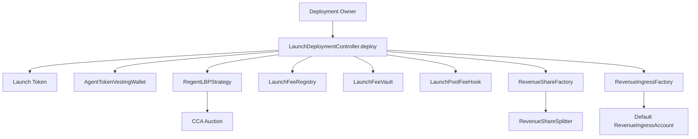
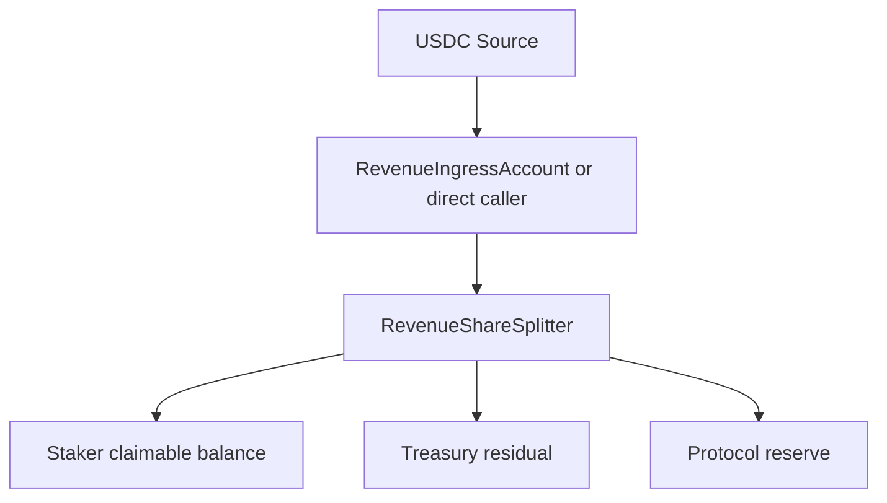
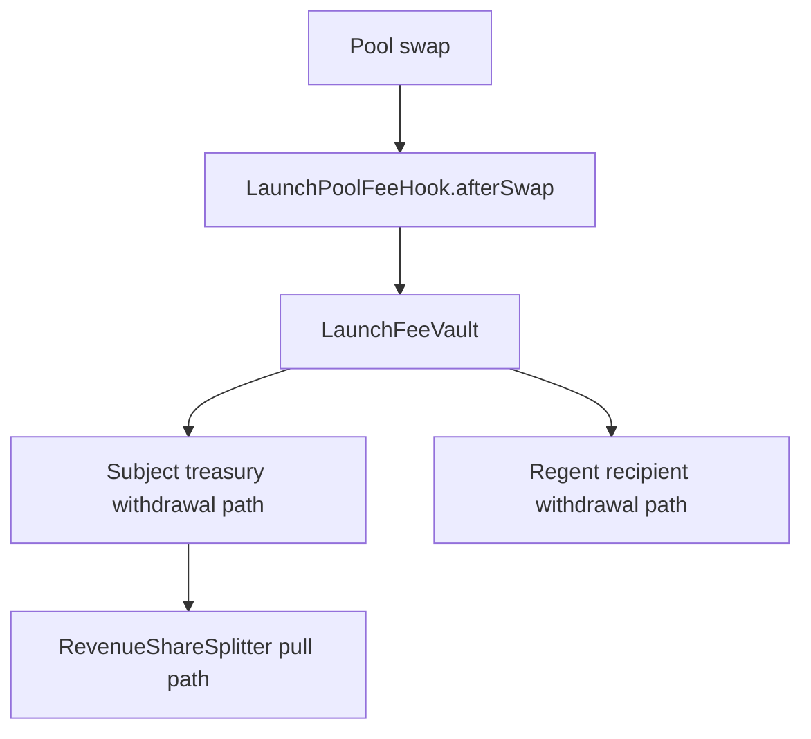

# Autolaunch Contracts Assumptions And Trust Boundaries

## Canonical Product Rules

These documents and contracts are consistent on the main operating rules:

- the launch path is Base-family only
- launch revenue is recognized only when Base-family USDC reaches the subject splitter
- the launch pool fee is split into a subject lane and a Regent lane
- the separate `RegentRevenueStaking` contract is not part of the per-launch subject path

## Core On-Chain Assumptions

### Token assumptions

- the launch token behaves like a standard ERC-20 for the main flow
- fee-on-transfer behavior is intentionally rejected for stake-token entry and claim paths
- USDC behaves as the canonical quote and revenue token

### External system assumptions

- the configured CCA factory returns the expected auction address and honors its initialization flow
- the configured Uniswap v4 pool manager and position manager are the intended official deployments
- the configured identity registry is trusted to represent subject identity linkage correctly

### Ownership assumptions

- the deployment owner is trusted during bootstrap
- the agent safe is trusted after handoff
- the strategy operator is trusted to execute migration and recovery in the intended time window

### Revenue-accounting assumptions

- both reward-accounting contracts use a fixed supply denominator and now reject stake or reward-restake actions that would push live stake above that denominator

## Off-Chain And Operational Assumptions

- deployment inputs are prepared correctly before `deploy`
- the operator runs migration only after the configured auction window and before recovery expectations change
- off-chain operators understand that coverage and Slither are not yet producing stable audit artifacts
- any manual funding of `RegentRevenueStaking` is operationally distinct from the launch path

## Trust Boundaries

### Boundary 1: Launch bootstrap

The deployment controller creates and wires almost the entire launch stack in one call. Mistakes in deployment input preparation can affect:

- token ownership and total supply distribution
- auction timing
- LP migration configuration
- fee recipients
- subject identity linkage

### Boundary 2: Auction to LP migration

The strategy receives auction proceeds, caps LP currency usage, initializes the official v4 pool, and mints the LP position. This is the most operationally fragile on-chain path because it spans:

- auction state
- token balances
- price initialization
- position manager calls
- post-migration sweep behavior

### Boundary 3: Revenue ingress to recognized revenue

Revenue is only recognized when USDC lands in `RevenueShareSplitter`, either directly or through:

- `RevenueIngressAccount.sweepUSDC`
- `RevenueShareSplitter.pullTreasuryShareFromLaunchVault`

This is the accounting boundary auditors should treat as canonical.

### Boundary 4: Subject lifecycle synchronization

`SubjectRegistry.updateSubject` forwards lifecycle changes into old and new splitter addresses. Correctness depends on:

- the current splitter address being valid
- lifecycle sync calls not being blocked
- manager rotation not accidentally orphaning control

## Primary Workflows

### Launch creation

### Revenue recognition

### Launch fee capture

## Recommended Audit Questions

1. Should the fixed-denominator reward model be enforced, capped, or redesigned?
2. Can any privileged path freeze assets or strand them in a partial migration state?
3. Are lifecycle sync calls safe if a subject rotates to a new splitter while inactive?
4. Are the rescue paths appropriately limited across all asset-holding contracts?
5. Are rounding losses and dust handling acceptable for the intended treasury and staker accounting model?
