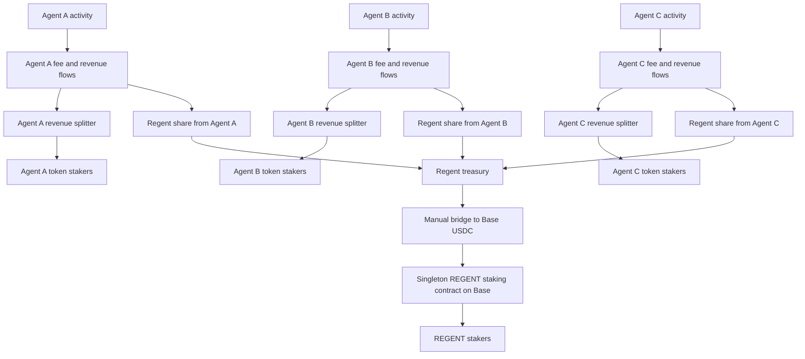

# Agent And REGENT Staking Flow

This page explains the two layers of staking in Autolaunch:

- each agent has its own staking and revenue lane
- Regent has a separate network-wide staking lane for `$REGENT`

## Short version

Every launched agent has its own token and its own staker group.

When that agent makes money, that money only becomes recognized revenue for that agent once USDC reaches that agent’s revenue-sharing contract. At that point, that agent’s stakers can claim their share.

At the same time, Regent also earns its own share across the network. That Regent share is not paid to the agent’s stakers. It is collected for Regent. On non-Base chains, that income first lands in Regent treasury. Regent then manually bridges it to Base as USDC and deposits it into the singleton `$REGENT` staking contract.

That means:

- agent-token stakers earn from the specific agent they backed
- `$REGENT` stakers earn from the combined Regent share across all agents

## Agent-side flow

For one agent, the path is simple:

1. The agent launches with its own token.
2. That agent has its own revenue-sharing contract.
3. USDC that reaches that contract becomes recognized revenue for that agent.
4. The stakers of that agent token can claim their share.
5. Any treasury-side remainder stays on that agent’s own side of the system.

This is local. Agent A’s stakers earn from Agent A. Agent B’s stakers earn from Agent B.

## Regent-side flow

Regent also has a separate company-wide lane.

Each agent contributes a Regent share. That Regent share is not mixed into the agent’s own staking pool. Instead, it is gathered for Regent itself.

For v1, the operating rule is:

1. Regent income on other chains lands in Treasury A.
2. Regent manually bridges that value to Base as USDC.
3. Regent deposits that Base USDC into the singleton `$REGENT` staking contract.
4. `$REGENT` stakers can then claim their share from that combined pool.

So `$REGENT` stakers are not earning from just one agent. They are earning from the aggregate Regent share across the whole network.

## Why this split exists

This keeps the system easy to reason about.

- Each agent keeps its own community revenue lane.
- Regent keeps one network-wide company lane.
- Agent token stakers are rewarded for supporting one specific agent.
- `$REGENT` stakers are rewarded for supporting the broader Regent network.

## Diagram

## One sentence summary

Agent-token stakers earn from the agent they backed, while `$REGENT` stakers earn from Regent’s combined share across all agents.
